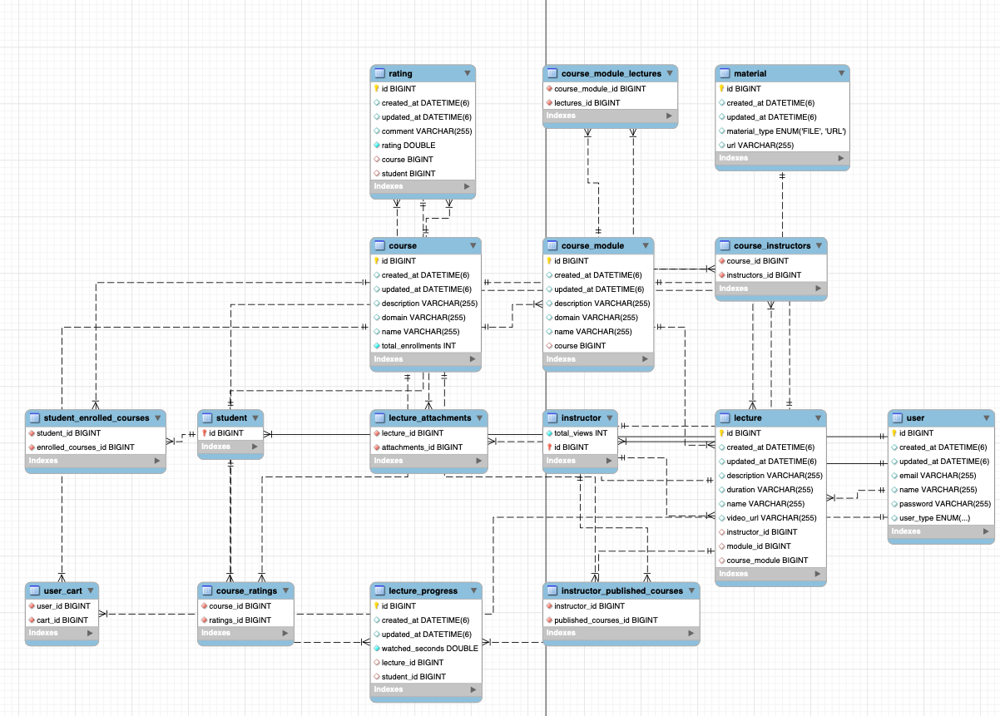

## UDEMY

#### Step - 1
##### Requirements
- 

##### API Endpoints
- addRating(courseId):POST - /api/course/{courseId}/addRating
- addToCart(courseId):POST - /api/course/{courseId}/addToCart
- signupStudent():POST - /api/student/signup
- loginStudent():POST - /api/student/loginStudent
- signupInstructor():POST - /api/instructor/signup
- loginInstructor():POST - /api/instructor/loginInstructor
- getInstructor(instructorId):POST - /api/instructor/{instructorId}
- createModule(instructorId, courseId):POST - /api/instructor/{instructorId}/courses/{courseId}/createModule
- getLectures(instructorId, courseId, moduleId):POST - /api/instructor/{instructorId}/courses/{courseId}/modules/{moduleId}/lectures
- updateProgress(courseId, lectureId):POST - /api/courses/{courseId}/lectures/{lectureId}/updateProgress
- getProgress(courseId, lectureId):GET - /api/courses/{courseId}/lectures/{lectureId}/getProgress
- 

#### Step -2 Class Diagram

#### Step -3 Schema/ER Diagram

### Development Issues and Resolutions
##### Issue - 1
